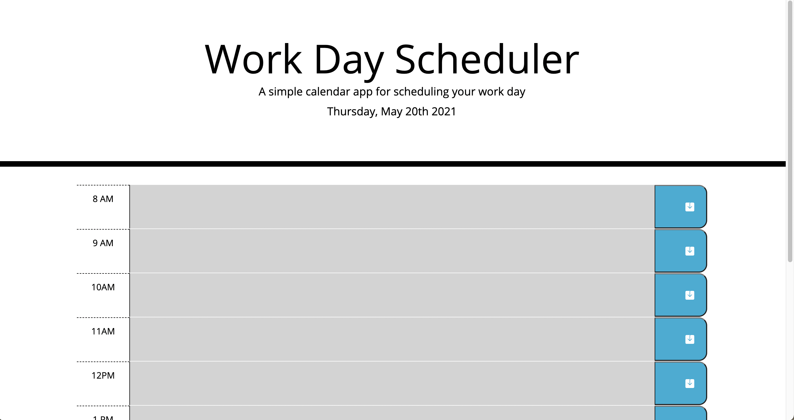
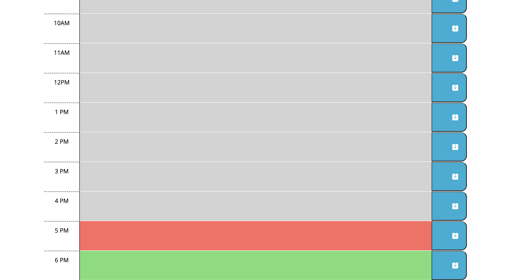
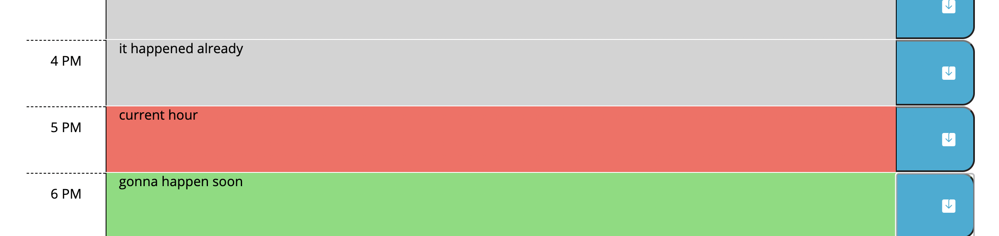

# Work Day Scheduler Starter Code

## Description
This website is about a daily planner to create a schedule with time blocks for standard business hours. The time blocks are color-coded to indicate if it is in past, present, or future. The events can be saved since it exist in local storage. 

---

## Built With
* HTML
* CSS variables
* Java Script
* local storage
* bootstrap
* jquery
* moment.js

---

## Screenshot

---

## Website
[Calendar]()

---

## Contribution
Made with love by Sonika Poudyal 
